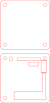
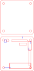

# Board Enclosure Files

Convienent dump spot for board enclosure files. Currently only contains files for a Tigard enclosure.

## Tigard Enclosure Notes
  

The Tigard enclosure was made using 3mm acrylic on an 80 watt laser cutter with a Ruida controller and using Lightburn for the software. The case is held together using M3 nuts and bolts. While the screw used is 20mm long, it does stick out and was simply the one on hand that was the closest fit, an 18mm long screw might work better.

SVG files are provided and should be able to be used with either a laser cutter or a mill. 

The 'clean' version (left) should be usable right away, while the 'wip' version (right) includes additional guide boxes and overlapping shapes for easy modification should fixes need to be made later.

 &nbsp;&nbsp;&nbsp;&nbsp; 
